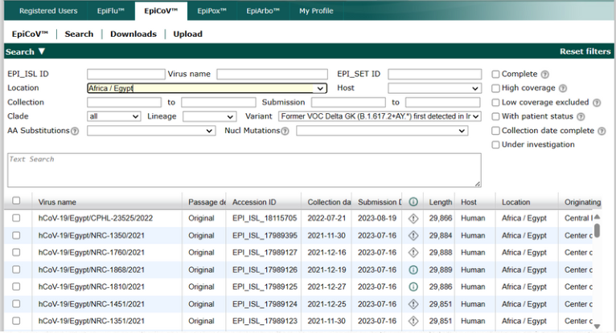
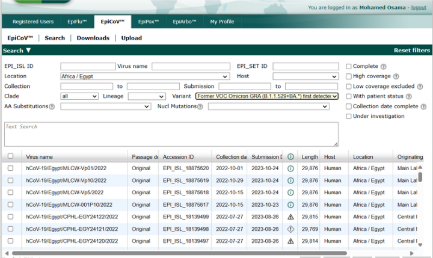
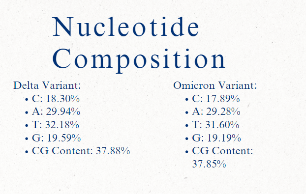
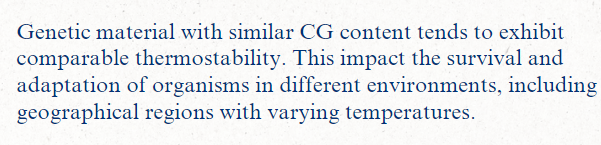
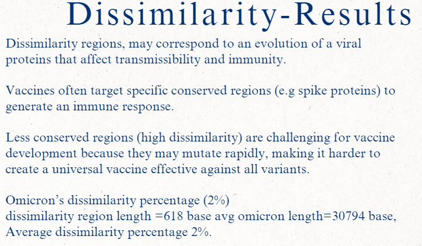
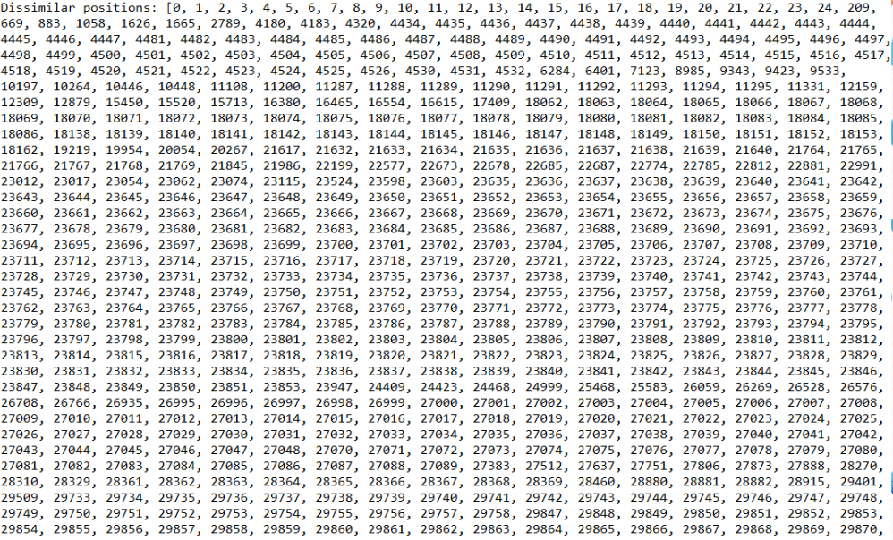
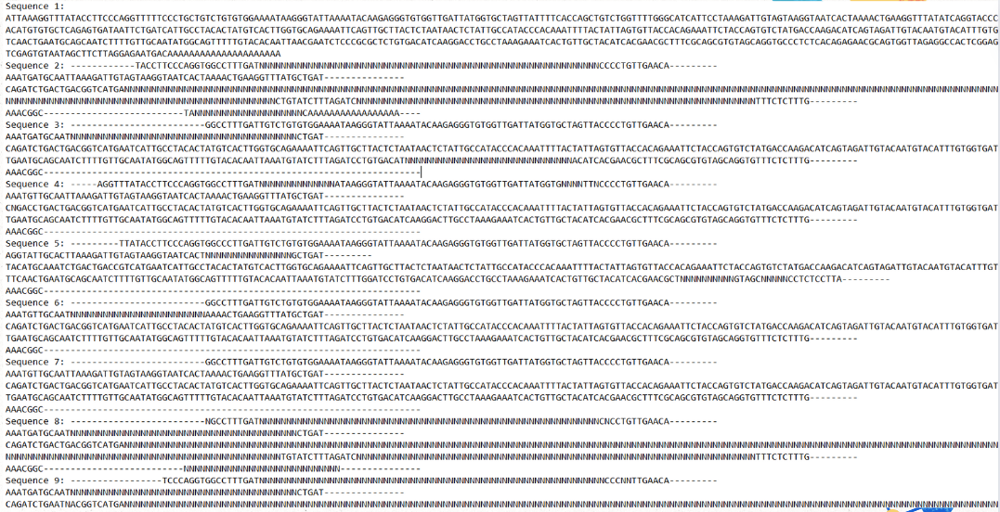

# Comparative Genomic Analysis of SARS-CoV-2 Delta and Omicron Variants

## Introduction

The emergence of SARS-CoV-2 variants has significantly impacted the course of the COVID-19 pandemic. Among these, the Delta and Omicron variants have garnered particular attention due to their enhanced transmissibility, potential for immune escape, and differences in pathogenicity. Understanding the genetic differences between these variants can provide insights into their behavior and inform public health strategies. This study aims to perform a comparative genomic analysis of the Delta and Omicron variants to elucidate their genetic differences and evolutionary relationships.

## Data Collection

We retrieved 10 sequences each of the Delta and Omicron variants from the GISAID database, a global repository for SARS-CoV-2 sequences. These sequences were chosen to represent the genetic diversity within each variant.

- --

### Software and Tools

The following software packages and tools were used in this study:
- Biopython
- Clustal Omega package
- matplotlib
- MEGA11x

#### Multiple Sequence Alignment

  - Useing Clustal Omega for multiple sequence alignment of the Omicron sequences.
  - Aligned Delta consensus sequence with Omicron sequences.

### Nucleotide Composition and CG Content

  - Calculated the average percentage of each nucleotide (A, T, C, G) for both variants.
  - Computed CG content using `gc_fraction`.
  #### Our Results 
  
  

### Phylogenetic Analysis

  - Constructed a phylogenetic tree using the Neighbor-Joining method.
  - Visualized and saved the tree as an image.
  - using bio.phylo (Phylo module)and Matplotlib .
  .png>)
  - using  Mega11x  for cyclic phlo tree for better visulization.
  .png>)
### Consensus Sequence Construction
 

  - Parsed sequences using SeqIO.
  - Constructed consensus sequences by identifying the most frequent nucleotide at each position across the sequences.

### Dissimilar Regions Identification
  - Comparing the consensus sequence of Delta with Omicron sequences.
  - Identifing the positions of the 10 omicron sequences with significant dissimilarities.
  
  
  

